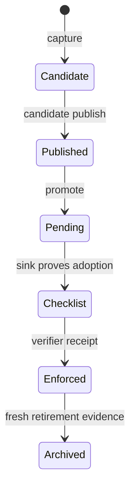

# One lesson, end to end

This walkthrough follows one synthetic lesson: when a shared constant changes, search for old literal consumers before declaring the integration complete. The verifier creates a temporary HOME, a temporary private-state checkout backed by a local bare remote, and two temporary runtime roots. It never touches a real runtime configuration or network remote.



The command contract deliberately includes separate plan and apply steps. `PLAN_HASH` binds the reviewed inputs; `EXPECTED_REMOTE_SHA` makes a concurrent remote update observable instead of silently overwriting it. Captured values are passed as complete argv elements. No command is evaluated by a shell.

<!-- COMMANDS:lifecycle:START -->

```console
$ python -m agent_core.cli lessons capture --config '<CONFIG>' --state '<STATE>' --control-root '<CONTROL>' --workspace '<ENGINE>' --agent codex --rule '当 shared constant changes，先检查旧字面量消费者' --trigger 'shared constant changes' --cost 'duplicate integration work' --sink rules/global.md --scope global --evidence synthetic:documented-lifecycle --when '{"text":["shared constant"]}'
CAPTURED <STATE>/inbox/<CANDIDATE>.md
```

```console
$ python -m agent_core.cli candidate publish --state '<STATE>' --control-root '<CONTROL>' --id '<CANDIDATE>'
PLAN operation=publish candidate=<CANDIDATE>
EXPECTED_REMOTE_SHA <PUBLISH_REMOTE_SHA>
PLAN_HASH <PUBLISH_PLAN_HASH>
```

```console
$ python -m agent_core.cli candidate publish --state '<STATE>' --control-root '<CONTROL>' --id '<CANDIDATE>' --apply --plan-hash '<PUBLISH_PLAN_HASH>' --expected-remote-sha '<PUBLISH_REMOTE_SHA>'
PASS remote_sha=<SHA> rollback=<ROLLBACK_ID>
```

```console
$ python -m agent_core.cli promote --state '<STATE>' --control-root '<CONTROL>' --id '<CANDIDATE>' --reviewed-against '<PUBLISHED_SHA>'
PLAN operation=promote candidate=<CANDIDATE>
EXPECTED_REMOTE_SHA <PROMOTE_REMOTE_SHA>
PLAN_HASH <PROMOTE_PLAN_HASH>
```

```console
$ python -m agent_core.cli promote --state '<STATE>' --control-root '<CONTROL>' --id '<CANDIDATE>' --reviewed-against '<PUBLISHED_SHA>' --apply --plan-hash '<PROMOTE_PLAN_HASH>' --expected-remote-sha '<PROMOTE_REMOTE_SHA>'
PASS remote_sha=<SHA> rollback=<ROLLBACK_ID>
```

```console
$ python -m agent_core.cli sync --config '<CONFIG>' --state '<STATE>' --apply
PASS backup_created=True
```

```console
$ python -m agent_core.cli lessons match --ledger '<LEDGER>' --stage prompt --text 'We are changing a shared constant; find old literal consumers' --explain
LESSON <LESSON_ID>: 当 shared constant changes，先检查旧字面量消费者. sink=rules/global.md MATCH predicate=text value="constant" query="We are changing a shared constant; find old literal consumers"
```

```console
$ python -m agent_core.cli lessons retire --workspace '<STATE>' --control-root '<CONTROL>' --report
NOT_READY <LESSON_ID> missing_sink_reference
```

<!-- COMMANDS:lifecycle:END -->

The final `retire --report` output is intentionally `NOT_READY`: promotion creates a pending lesson, while retirement requires a real consumer and later evidence. The report is read-only. Moving to `checklist`, `enforced`, or `archived` remains a separate reviewed state transition.

## Canonical transaction recovery notes

For canonical transactions, remote Git ancestry is the recovery truth, journal phase is only a hint, and a durable snapshot is recovery material. A snapshot without a valid journal baseline is an orphan: it is ignored by execution and reported as `ORPHAN_SNAPSHOT <id>` in a read-only plan; it is never deleted automatically. `REMOTE_COMMITTED_LOCAL_STALE` requires read-only fetch and ancestry confirmation before any replan, repush, or artifact deletion. Reviewed R1 recovery local apply and guarded canonical rollback apply are available under their explicit config, binding, token, lock, and journal gates; automatic startup/resume recovery remains pending.

Windows durability here means same-volume atomic rename after file-content `fsync`. Directory metadata durability and `MOVEFILE_WRITE_THROUGH` are not claimed; remote Git ancestry remains the recovery backstop.

Snapshot and journal finalizers reject collisions instead of replacing an existing artifact. Complete-operation concurrency remains guarded by the canonical operation lock introduced in the later apply phase.

Canonical recovery artifacts use Git SHA-1 object IDs only. Git SHA-256 repository support requires a future whole-chain migration card; mixed or local 64-character object-ID acceptance is rejected.

C2a-R0 recovery is an advisory, read-only canonical plan for one explicit prepared commit. It validates the immutable original apply journal and snapshot, records one pinned observation in the reviewable plan hash, and classifies only `artifact-cleanup`, `input-disposition`, `cleanup-only`, or `local-finalization`. R0 never pushes, fast-forwards, updates remote pointers, or creates recovery artifacts. It has no time expiry: reviewed R1 local apply holds its write lock and re-proves every bound artifact, target blob, and observation equality before local action; a changed observation requires a new R0 plan.

C2a-R1a defines the host-local recovery checkpoint grammar used by reviewed R1 local apply. Its separate journal binds the immutable original journal final hash, snapshot, reviewed plan, binding/control identity, observation, and action. Checkpoint details carry only closed roles and hashes, never paths or business content. A chain reaches `converged` once before `completed`; `failed` is terminal before convergence. Only input disposition and local finalization may record one immediate, best-effort `cleanup-pending` after completion. That append reports retained cleanup work and never changes the already converged outcome.

Input disposition reaches convergence only after one source proof: a completed restore pair or the no-write `source-preserved` fact. The latter records stable input and handle identities without an intent because it makes no mutation. Recovery journal publication creates a new hard link and then removes its owned temporary link, so an existing regular entry, directory, or dangling alias is never replaced.

C2a-R1b local recovery consumes one reviewed R0 plan while holding the canonical operation lock. It does not fetch, re-observe, push, or resume an existing recovery journal. All mutable local artifacts are revalidated before the separate recovery baseline, every pre-convergence local mutation has a durable checkpoint, and a drift after that baseline is retained only as a closed failed checkpoint. Cleanup after convergence is best-effort bookkeeping and cannot turn a converged result into failure.

Canonical `recover` uses an explicit host config to select the public canonical transaction boundary. A review plan remains read-only; an apply requires the exact one-shot plan hash and observed SHA, never pushes, and refuses an existing recovery journal. Config-free recovery preserves the standalone output contract; a config is not a standalone routing hint.

Canonical rollback R0 is a read-only forward-only plan for an explicit canonical snapshot artifact. It validates the immutable source journal and snapshot, a settled source operation, current binding identity, and one remote observation exactly equal to the original target. A re-attach or re-acceptance changes the binding identity and permanently disqualifies older rollback artifacts. The plan binds only a restore count and digest, never restores paths directly. R0 itself creates no lock, worktree, journal, reset, force push, or deletion. Standalone rollback retains its legacy behavior.

Canonical rollback R1a derives a detached inverse prepared commit from the reviewed R0 plan and revalidates its local proof while the transaction lock is held. It does not alter immutable source artifacts. R1b-1 uses its in-process capsule only as equality evidence beside a full lock-held reproof; its bounded registered-worktree residue remains explicit host-local lifecycle state.

C2b-R1b-0 reserves the completion grammar for that residue without opening rollback apply. A completed rollback may record only `cleanup_pending(kind=worktree)` after its `completed` event. The worktree is inert and does not prevent rollback-of-rollback planning; canonical recovery reports it as non-actionable and never invokes a remover. Quarantine cleanup remains distinct and blocks rollback settlement until a future explicit action resolves it.

C2b-R1b-1 enables the guarded canonical rollback apply. Under the exclusive transaction lock it re-proves the reviewed inverse and binding, takes one pre-push observation, uses the target as an exact lease, then takes one post-push observation to determine outcome. Push process status is not outcome truth. Snapshot and journal are durable before the lease, successful convergence retains the registered rollback worktree and records `completed` followed by `cleanup_pending(kind=worktree)`, and neither rollback nor recovery automatically removes that residue.

Canonical remote outcome uses one pinned fetched head: it is classified as not committed, committed, lost race, or unsafe. Push output is never transaction truth. This B1 primitive remains unattached to apply, source removal, and recovery.

Pinned canonical observation requires Git fetch porcelain support from Git 2.41 or newer. macOS cutover must verify that Git version before use; this phase provides no legacy-Git fallback.

Canonical publish, promote, and evidence-driven advance apply only after the one pinned observation proves a committed, state-only ancestry. Advance commits only its frozen evidence blob and deterministic ledger transition; it has no local source removal or quarantine. A publish input is first moved once into a same-volume Git-metadata quarantine, never unlinked directly; successful completion clears it. If cleanup and its `cleanup_pending` journal event both fail after `completed`, the retained directory is still reported as `QUARANTINE_PENDING <operation-id>` in a later read-only plan. Reviewed recovery local apply and canonical rollback R1b-1 are available only through explicit config, binding, token, lock, and journal gates; automatic startup/resume recovery remains pending.

## Reproduce the transcript

```console
$ python -m agent_core.cli docs verify --commands docs/commands.json
PASS docs_verify commands=11
```

The verifier checks every exit code and anchored output contract, captures only declared values, compares every displayed output line with the normalized real stdout, and removes the temporary fixture on success or failure. `docs render --check` then proves the bounded README and lifecycle blocks still match the same argv source.
